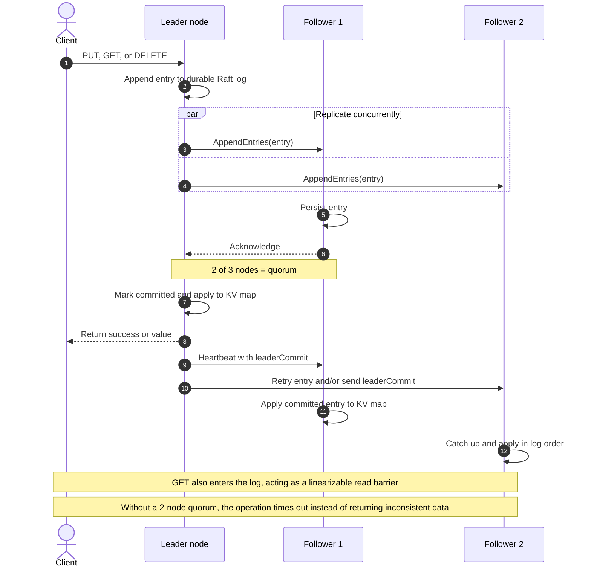

# dkv

`dkv` is a small, strongly consistent distributed key-value database written in
Go. It is a learning implementation of the central idea behind etcd: a replicated
state machine whose command log is ordered by the Raft consensus algorithm.

It uses only the Go standard library.

> This is educational software, not a production database. The code favors a
> visible algorithm over performance, security, and operational features.

## What “strongly consistent” means here

All successful `PUT`, `GET`, and `DELETE` operations are **linearizable**. They
appear to happen one at a time in a single global order, even when clients send
requests concurrently to different machines.

The simple mechanism is:

1. Only the elected leader accepts key-value operations.
2. The leader appends every operation to its Raft log.
3. It waits until a majority has durably stored the entry.
4. It applies committed entries to the key-value map in log order.
5. Only then does it answer the client.

Even `GET` is appended to the log as a read barrier. This is slower than etcd's
optimized ReadIndex path, but it makes the linearizability argument much easier
to see: a read cannot pass an earlier committed write.

## How an operation moves through the cluster



Clients may contact any node, but only the current leader processes key-value
operations. A follower responds with HTTP 503 and a leader hint. The leader can
change after an election; the new leader continues from the committed Raft log.

For a three-node cluster, a majority is two. The database can therefore continue
with one unavailable node. With two unavailable nodes, it stops accepting
operations instead of risking inconsistent answers. That is the CP choice in the
CAP theorem.

## Scope

Included:

- randomized Raft leader election;
- durable terms, votes, logs, and commit indexes;
- AppendEntries log replication and conflict repair;
- majority commit rules;
- leader failover;
- linearizable `PUT`, `GET`, and `DELETE`;
- crash recovery by replaying the committed log;
- static cluster membership;
- integration tests that run a three-node cluster.

Deliberately deferred:

- log snapshots and compaction;
- dynamic membership changes;
- request deduplication and client sessions;
- follower read optimization;
- automatic client redirection;
- TLS, authentication, authorization, metrics, and discovery;
- sharding (etcd itself is a replicated keyspace, not a sharded database).

## Run a three-node cluster

Requirements: Go 1.23 or newer and `curl`.

Build the binary:

```bash
make build
```

For a quick demo, one script can build and start all three nodes. It keeps their
durable state under `data/` and runs until you press Ctrl-C:

```bash
./scripts/run-cluster.sh
```

Start each node in a separate terminal. Every node receives the exact same static
membership list:

```bash
PEERS='n1=http://127.0.0.1:9001,n2=http://127.0.0.1:9002,n3=http://127.0.0.1:9003'

./bin/dkv -id n1 -listen 127.0.0.1:9001 -peers "$PEERS" -data-dir data/n1
./bin/dkv -id n2 -listen 127.0.0.1:9002 -peers "$PEERS" -data-dir data/n2
./bin/dkv -id n3 -listen 127.0.0.1:9003 -peers "$PEERS" -data-dir data/n3
```

After roughly half a second, inspect the nodes:

```bash
curl -s http://127.0.0.1:9001/v1/status
curl -s http://127.0.0.1:9002/v1/status
curl -s http://127.0.0.1:9003/v1/status
```

Exactly one reports `"role":"leader"`. Send operations to that node (the
examples assume it is `n1`):

```bash
curl -i -X PUT http://127.0.0.1:9001/v1/kv/language \
  -H 'Content-Type: application/json' \
  -d '{"value":"Go"}'

curl -i http://127.0.0.1:9001/v1/kv/language

curl -i -X DELETE http://127.0.0.1:9001/v1/kv/language
```

A follower returns HTTP 503 with its current leader hint:

```json
{
  "error": "node is not the leader",
  "leader_id": "n1",
  "leader_url": "http://127.0.0.1:9001"
}
```

Clients should follow that hint and retry. A timeout is ambiguous: the operation
may have committed even though its response was lost. Production systems solve
this with request IDs and deduplication; adding that is a useful later exercise.

## Failure experiments

These are more educational than a happy-path demo:

1. Write a key, stop a follower, and verify the leader still serves requests.
2. Restart that follower and watch its `last_log_index` catch up.
3. Stop the leader and observe one of the two remaining nodes become leader.
4. Stop one more node. The last node remains responsive at `/v1/status`, but key
   operations time out because it cannot obtain a quorum.
5. Restart either stopped node and verify progress resumes without lost committed
   writes.

Do not reuse one node's data directory for another node ID. To create a genuinely
new cluster for experiments, use new empty directories.

## HTTP API

| Method | Path | Meaning |
| --- | --- | --- |
| `PUT` | `/v1/kv/{key}` | Store JSON body `{"value":"..."}` |
| `GET` | `/v1/kv/{key}` | Perform a linearizable read |
| `DELETE` | `/v1/kv/{key}` | Delete a key |
| `GET` | `/v1/status` | Inspect local Raft state (diagnostic only) |

The `/raft/*` routes are internal peer RPCs, exposed on the same listener only to
keep the example small.

## Code map

```text
cmd/dkv/main.go             flags, process lifecycle, HTTP listener
internal/api/server.go      client API and peer RPC transport
internal/raft/node.go       elections, replication, commit, state machine
internal/raft/storage.go    durable atomic state-file replacement
internal/raft/types.go      Raft messages, log entries, and commands
internal/api/cluster_test.go three-node failure tests
```

The best reading order is `types.go`, `storage.go`, then `node.go`. In
`node.go`, follow `startElection`, `replicatePeer`, `advanceCommitLocked`, and
`applyCommittedLocked` in that order.

## Verify

```bash
make test
make test-race
```

The cluster tests bind loopback TCP ports. Sandboxed environments must allow
local socket creation.

## Suggested learning milestones

1. Add table-driven tests for RequestVote's log freshness rule.
2. Add client request IDs and a replicated deduplication table.
3. Replace log-backed reads with the Raft ReadIndex protocol.
4. Add snapshots, then discard log prefixes safely.
5. Implement joint-consensus membership changes.

Each milestone removes one deliberate simplification while preserving the same
linearizability contract.
